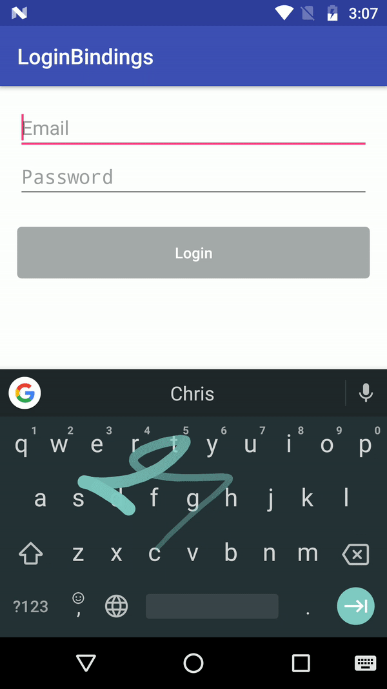

## Login Bindings

Login Bindings demonstrates how we can use Data Binding for callbacks from a Login Form



## How to Use

Enable Data Binding in your app build.gradle

```groovy
dataBinding {
    enabled = true
}
```

## ViewModel

A ViewModel should extend BaseObservable for the mechanism to be reactive. Use `notifyPropertyChanged` to get callbacks for email and password fields and hence manipulate the login button. Here is how the LoginModel should look like.

```java
public class LoginModel extends BaseObservable {

	private String email;
	private String password;
	private boolean loginEnabled;

	@Bindable
	public String getEmail() {
		return email;
	}

	public void setEmail(String email) {
		this.email = email;
		notifyPropertyChanged(BR.email);
		setLoginEnabled(isEmailAndPasswordSet());
	}

	@Bindable
	public String getPassword() {
		return password;
	}

	public void setPassword(String password) {
		this.password = password;
		notifyPropertyChanged(BR.password);
		setLoginEnabled(isEmailAndPasswordSet());
	}

	@Bindable
	public boolean isLoginEnabled() {
		return loginEnabled;
	}

	public void setLoginEnabled(boolean loginEnabled) {
		this.loginEnabled = loginEnabled;
		notifyPropertyChanged(BR.loginEnabled);
	}

	/**
	 * checks if email and password fields are set
	 *
	 * @return isEmailAndPasswordSet
	 */
	private boolean isEmailAndPasswordSet() {
		return !TextUtils.isEmpty(getEmail()) && !TextUtils.isEmpty(getPassword());
	}
}
```

In your activity, bind the ViewModel with the view as follows:

```java
ActivityMainBinding binding = DataBindingUtil.setContentView(this, R.layout.activity_main);

binding.setModel(new LoginModel());
```

## Reference

- [Data Binding Library](https://developer.android.com/topic/libraries/data-binding/index.html)